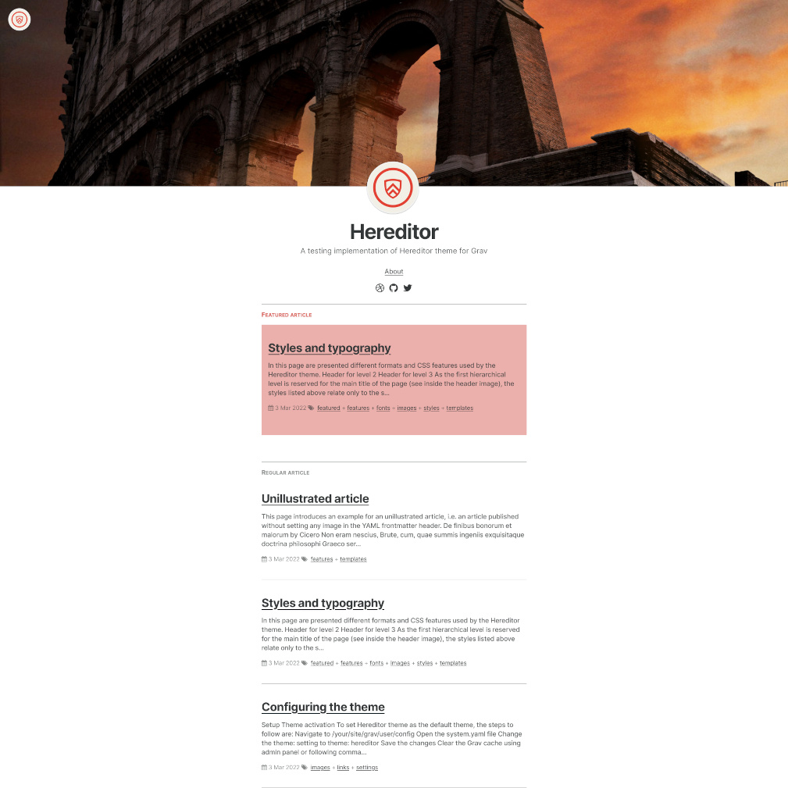

# Hereditor Theme



## About

### Background

The _Hereditor_ theme for [Grav](https://github.com/getgrav/grav) is a detached fork of the [_Mediator_ theme](https://github.com/getgrav/grav-theme-mediator) developed by [Grav Team and contributors](https://github.com/getgrav/grav-theme-mediator/graphs/contributors), which was a port of the [_Mediator_ theme](https://github.com/dirkfabisch/mediator) for [Jekyll](https://github.com/jekyll/jekyll) designed by [Dirk Fabisch](https://twitter.com/dirkfabisch), which in turn was inspired by the [_Readium_ theme](https://github.com/starburst1977/readium) for [Ghost](https://github.com/TryGhost/Ghost) elaborated by [Sven Read](https://twitter.com/starburst1977).

The wording _Hereditor_ comes from a [Latin verb](https://en.wiktionary.org/wiki/heredito#Latin) relating to heirs what seems quite logical for a project that has so many ancestors!

### Theme preview

In order to preview this theme in action more effectively than a simple screenshot, a [demonstration implementation](https://htg.gizmecano.net/) (based on the [_Hereditor_ skeleton](https://github.com/gizmecano/grav-skeleton-hereditor-site)) is available online.

### Downloads

You can download the _Hereditor_ theme individually on [its own repository](https://github.com/gizmecano/grav-theme-hereditor) but it might be better to download the full [_Hereditor_ skeleton](https://github.com/gizmecano/grav-skeleton-hereditor-site).

### References

You can find out more info about customizing a Grav theme (as well as basic usage documentation on the official [Grav Documentation](https://learn.getgrav.org/)) and check the full source code on [GitHub](https://github.com/getgrav/grav).

### License

The _Hereditor_ theme is free and open source software, distributed under the [MIT License](/LICENSE) version 2 or later. So feel free to to modify this theme to suit your needs.

--------------------------------------------------------------------------------

## Overview

### Features

- Minimal design
- Responsive layout
- Header images in posted articles
- Support of _featured_ posted articles
- Implementation of [Font Awesome](https://github.com/FortAwesome/Font-Awesome) for icons fonts use
- Integration of free and open source improved fonts (WOFF 2.0)

### Supported page types

The _Hereditor_ theme was mainly conceived to craft a simple blog and supports four distinct page types via templates:

- **default**: a template used to display the default blog listing view
- **error**: a very simple template to display an error page
- **post**: a full page for displaying a blog post
- **page**: similar to the post template, but without any author information

### Embedded assets

- [Font Awesome](https://github.com/FortAwesome/Font-Awesome/) (version 4.7.0, font file licensed under the SIL OFL 1.1 and `CSS` file licensed under the MIT License), is _a suite of_ (...) _pictographic icons for easy scalable vector graphics on websites, created and maintained by Dave Gandy_
- [Inter](https://github.com/rsms/inter) (version 3.19, © The Inter Project Authors, licensed under the SIL Open Font License 1.1), is _a variable font with several OpenType features_ which has been _crafted & designed for computer screens_ ("Inter" is trademark of Rasmus Andersson)
- [Libertinus Fonts](https://github.com/alerque/libertinus) (version 7.040, © The Libertinus Project Authors, released under the terms of the Open Font License, version 1.1, with Reserved Font Name "Linux Libertine", "Biolinum", "STIX Fonts"), is a typeface project which includes _four main type families_ which were _originally forked from Linux Libertine_ (only four files for two weights --Regular and Bold-- in two styles --Regular, Italic-- of the Serif family are embedded in the theme)
- [normalize.css](https://github.com/necolas/normalize.css) (version 8.0.1, © Nicolas Gallagher and Jonathan Neal released under MIT License) _is a small `CSS` file_ which aims to _render_ (...) _elements more consistently_ (...) _with modern standards_ (and) _precisely targets only the styles that need normalizing_

### Additional pictures

Additional pictures used to craft the _Hereditor_ skeleton package belong to their original authors according to the [Unsplash licence](https://unsplash.com/license). The list below provides precise attributions:

- [Photo](https://unsplash.com/photos/JazIGJ8_iw4) by [Bence Boros](https://unsplash.com/@benceboros)
- [Photo](https://unsplash.com/photos/lUO-BjCiZEA) by [Dario Veronesi](https://unsplash.com/@dariovero_)
- [Photo](https://unsplash.com/photos/tYCXnplTqyQ) by [Cassiane Boff](https://unsplash.com/@cassiboff)
- [Photo](https://unsplash.com/photos/upGZ5p92SHU) by [Melanie van Leeuwen](https://unsplash.com/@strompictures)

--------------------------------------------------------------------------------

## Using the skeleton

The simplest way to install the _Hereditor_ theme is to download and install the _Hereditor_ skeleton package:

1. Download the [_Hereditor_ skeleton](https://github.com/gizmecano/grav-skeleton-hereditor-site)
2. Unzip the package into your web root folder.
3. Point your browser at the folder.

Check out the [general Grav installation instructions](https://learn.getgrav.org/basics/installation) for more details on this process.

It is possible to install just the theme as described below, but page content will need to fit the templates supported  the _Hereditor_ theme. It is strongly advised to at least install the _Hereditor_ skeleton package as described above to see the structuration of the theme in action.

## Installing the theme

Installing the _Hereditor_ theme can be done in one of two ways. Using the GPM (Grav Package Manager) installation method enables to quickly and easily install the theme with a simple terminal command, while the manual method enables to do so via a `zip` file.

### GPM installation

The simplest way to install the theme is via the [Grav Package Manager (GPM)](http://learn.getgrav.org/advanced/grav-gpm) through the system's Terminal (also called _the command line_). From the root of the Grav install type:

```bash
bin/gpm install hereditor
```

This will install the _Hereditor_ theme into your `/user/themes` directory within Grav. Its files can be found under `/your/site/grav/user/themes/hereditor`.

### Manual installation

To install the theme, just download the `zip` version of this repository and unzip it under `/your/site/grav/user/themes`. Then, rename the folder to `hereditor`. These files can be found on [GitHub](https://github.com/gizmecano/grav-theme-hereditor/) or via [GetGrav.org](http://getgrav.org/downloads/themes).

All the _Hereditor_ theme files should be into the folder `/your/site/grav/user/themes/hereditor`.

## Updating the theme

As development for the _Hereditor_ theme continues, new versions may become available that add additional features and functionality, improve compatibility with newer Grav releases, and generally provide a better user experience. Updating the _Hereditor_ theme is easy, and can be done through Grav's GPM system, as well as manually.

### GPM update

The simplest way to update this theme is via the [Grav Package Manager (GPM)](http://learn.getgrav.org/advanced/grav-gpm). Navigate to the root directory of the Grav install using the system's Terminal (also called _command line_) and type the following:

```bash
bin/gpm update hereditor
```

This command will check the Grav install to see if the _Hereditor_ theme is due for an update. If a newer release is found, it will be asked whether or not proceed to update. To continue, type `y` and hit enter. The theme will automatically update and clear Grav's cache.

### Manual update

Manually updating the _Hereditor_ theme is pretty simple:

- Delete the `your/site/user/themes/hereditor` directory
- Download the new version of the _Hereditor_ theme from [GitHub](https://github.com/gizmecano/grav-theme-hereditor/) or [GetGrav.org](https://getgrav.org/downloads/themes)
- Unzip the `zip` file in `your/site/user/themes` and rename the resulting folder to `hereditor`
- Clear the Grav cache using admin panel or following command:

```bash
bin/grav clear-cache
```

Note that any changes made to any of the files listed under this directory will also be removed and replaced by the new set. Any files located elsewhere (for example a `YAML` settings file placed in `user/config/themes`) will remain intact.

--------------------------------------------------------------------------------

## Setup

### Theme activation

To set the _Hereditor_ theme as the default theme, the steps to follow are:

- Navigate to `/your/site/grav/user/config`
- Open the `system.yaml` file
- Change the `theme:` setting to `theme: hereditor`
- Save the changes
- Clear the Grav cache using admin panel or following command:

```bash
bin/grav clear-cache
```

Once this is done, the new theme should be available on the frontend. Keep in mind any customizations made to the previous theme will not be reflected as all of the theme and templating information is now being pulled from the `hereditor` folder.

### Site parameters

In case the _Hereditor_ theme is activated on a fresh Grav install, some parameters in the `user/config/site.yaml` file have to be populated:

1. `title`: name of your site
2. `description`: description of your site
3. `author.name`: name site owner
4. `author.email`: mail address of the site owner
5. `author.bio`: short one sentence biography

The file should look a bit like this:

```yaml
title: Website name
description: A short description for the purpose of the website
author:
  name: Author Name
  email: username@domain.tdl
  bio: A short description of the author of the website
```

### Custom styles for plugins

The _Hereditor_ theme includes custom styles for specific plugins ([Markdown Notices](https://github.com/getgrav/grav-plugin-markdown-notices), [Pagination](https://github.com/getgrav/grav-plugin-pagination)). To be properly loaded, the _Use built in CSS_ option has to be set to `false` (using the admin panel or configuring the `YAML` file in the `users/config/plugins/` folder):

```yaml
built_in_css: false
```

## Configuring images and links

### Website images

Basically, the _Hereditor_ theme is arranged to use two images for the entire website:

1. `logo`: used into default page and to link toward the home page (but also as basic shortcut icon). This image aims to represent the website and should not exceed a size close to 300px × 300px.
2. `author.image`: set as illustration in the mini-bio. This image aims to represent the author of an article and should not exceed a size close to 300px × 300px.

These two images have to be defined in your `/your/site/grav/user/config/site.yaml` file, such as:

```yaml
logo: /user/images/logo.png
author:
  image: /user/images/avatar.png
```

### Article header images

Header images can be used in articles which are based on the **post** template. Any header image has to be declared in the front-matter section of the post, by adding a tag `image` populated with a proper URL to the intented file, such as this code sample (if the image is set in the same folder as the article):

```yaml
image: header-image.jpg
```

### Social links

In order to set social profiles features to be embedded in the _Hereditor_ theme configuration, add the following to your `/your/site/grav/user/config/site.yaml` file:

1. `social.icon`: name of the social platform
2. `social.link`: the main URL of the plateform
3. `social.user`: the specific user name on the plateform

Below is an example for a Twitter account:

```yaml
social:
  - icon: twitter
    link: https://twitter.com/
    user: username
```
